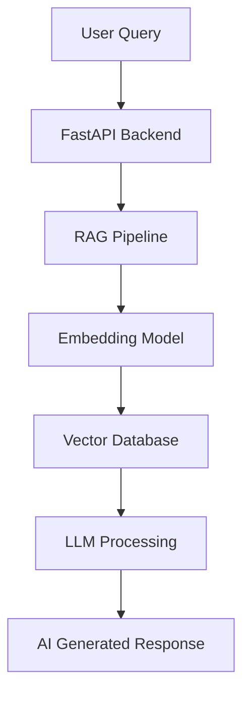

<div align="center">


</div>

---

#  About Me


```yaml
Name: Abishek R
Role: AI Engineer & AI Research Scientist
Education: B.Tech AIML @ Panimalar Engineering College
Location: Tamil Nadu, India
Company: TulasiAI
Focus:
  - Artificial Intelligence
  - Generative AI
  - Large Language Models
  - Deep Learning
  - Scalable AI Systems
  - FastAPI Architectures
Goal:
  - Build world-class AI products
  - Crack MAANG-level AI roles
```

<br>

- 🎓 B.Tech Artificial Intelligence & Machine Learning Student  
- 🚀 Founder & CEO of TulasiAI  
- 🤖 Passionate about AI Systems & Generative AI  
- 🧠 Exploring LLMs, RAG Pipelines & AI Infrastructure  
- ⚡ Building scalable AI-powered applications  
- 🏆 Hackathon Enthusiast & AI Innovator  

---

# 🌌 TulasiAI — Intelligent AI Learning Ecosystem

<div align="center">


</div>

## ⚡ What is TulasiAI?

TulasiAI is an advanced AI-powered educational ecosystem designed to redefine digital learning using next-generation Large Language Models and intelligent AI workflows.

### 🧠 Core Features

✅ AI-Powered Learning Assistant  
✅ RAG-based Intelligent Question Answering  
✅ PDF Upload & Semantic Search  
✅ Contextual AI Responses  
✅ FastAPI Backend Infrastructure  
✅ Modular & Scalable Architecture  
✅ LLM-based Knowledge Processing  
✅ AI Workflow Optimization  

---

# 🧠 System Architecture



---

# ⚡ Tech Arsenal

<div align="center">


</div>

---

# 🧠 AI / ML Expertise

<div align="center">

<table>
<tr>
<td align="center" width="300">

### 🤖 Artificial Intelligence
LLMs  
Transformers  
RAG Pipelines  
AI Agents  
Prompt Engineering  

</td>

<td align="center" width="300">

### 🧠 Machine Learning
Scikit-Learn  
Model Evaluation  
Feature Engineering  
Data Processing  

</td>

<td align="center" width="300">

### 🔥 Deep Learning
PyTorch  
CNNs  
Neural Networks  
Model Training  

</td>
</tr>
</table>

</div>

---

# 🚀 Featured Project

<div align="center">

<a href="https://github.com/Abishek2207">


</a>

</div>

---

# 📊 GitHub Analytics

<div align="center">


</div>

---

# ⚡ 3D Contribution Graph

<div align="center">


</div>

---

# 🐍 3D Contribution Snake Animation

<div align="center">


</div>

---

# 🛸 AI Coding Animation

<div align="center">


</div>

---

# 🏆 Achievements

<div align="center">

| Achievement | Year |
|---|---|
| 🏆 Handloom Hackathon Grand Finale Finalist | 2025 |
| 🚀 NASA Space Apps Challenge Participant | 2026 |
| 🤖 AI/ML Intern at TANSAM (TIDCO & Siemens) | 2025 |
| 🧠 Generative AI Program – Tata | 2025 |
| ⚡ Advanced Software Engineering Simulation – Forage | 2025 |

</div>

---

# 📚 Currently Learning

```python
class AbishekR:

    def __init__(self):
        self.learning = [
            "Advanced Deep Learning",
            "LLM Engineering",
            "AI Infrastructure",
            "Distributed AI Systems",
            "DSA for MAANG",
            "Model Optimization"
        ]

    def future_goal(self):
        return "Build globally impactful AI systems 🚀"

me = AbishekR()
print(me.future_goal())
```

---

# 🌐 Connect With Me

<div align="center">

<a href="https://www.linkedin.com/in/abishekr22/">

</a>

<a href="https://github.com/Abishek2207">

</a>

<a href="mailto:abishekramamoorthy22@gmail.com">

</a>

</div>

---

# 🧬 AI Activity Visualization

<div align="center">


<br><br>


</div>

---

# 💻 Developer Philosophy

<div align="center">


</div>

---

# 🚀 Future Mission

<div align="center">

⚡ Build powerful AI ecosystems  
⚡ Scale TulasiAI globally  
⚡ Contribute to advanced AI research  
⚡ Become a world-class AI Engineer  
⚡ Crack MAANG-level AI roles  

</div>

---

<div align="center">


# ⚡ "Building the Future with Artificial Intelligence" ⚡


</div>
